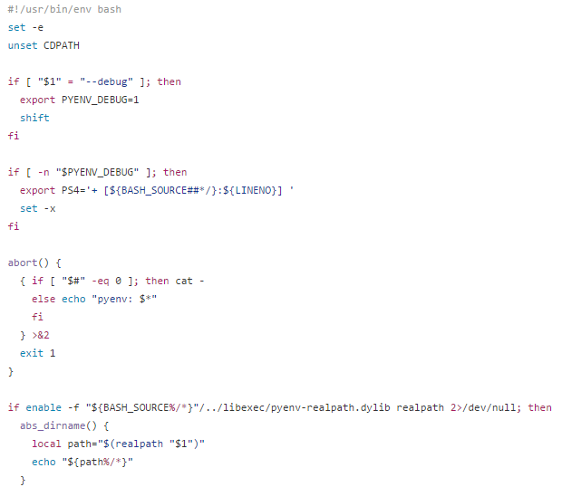

# python好库之sh

> 一直以来linux命令也只是用到时去查一下, 但是当看到比较大的bash 脚本时就有点畏缩了,但是在linux下工作调用命令还是必须的,终于找到一种解决方案,通过[sh](http://amoffat.github.com/sh)可以像调用函数一样调用linux下系统命令.

先看一段shell脚本



总感觉看起来没有那么pythonic. 虽然是看了一些bash基础语法,但是过一段时间就忘记了...


## sh

 sh将系统的命令动态映射到python函数,通过python的方式去写shell脚本.

##### 安装

```pip install sh```

##### 基本使用

获取网络接口信息:

```python
import sh
print sh.ifconfig("eth0")

# 或者
from sh import ifconfig
print ifconfig("eth0")
```

输出:

```shell
eth0      Link encap:Ethernet  HWaddr 00:16:3e:00:13:d7  
          inet addr:10.162.223.199  Bcast:10.162.223.255  Mask:255.255.240.0
          UP BROADCAST RUNNING MULTICAST  MTU:1500  Metric:1
          RX packets:71475 errors:0 dropped:0 overruns:0 frame:0
          TX packets:78854 errors:0 dropped:0 overruns:0 carrier:0
          collisions:0 txqueuelen:1000
          RX bytes:51051493 (51.0 MB)  TX bytes:6101887 (6.1 MB)

```

打印目录信息:

```python
sh.ls("/home", "-l")
```

输出:

```shell
total 8
drwxr-xr-x 2 root root 4096 Nov  4 10:52 a
-rw-r--r-- 1 root root   88 Nov  4 10:54 a.txt
```

##### 关键字参数

当命令里需要参数时,sh调用表现方式会像你期望的一样.下面是一个下载页面到本地文件的命令:

```curl https://www.baidu.com -o page.html --silent```

对应的sh方式为:

```sh.curl("https://www.baidu.com", o="page.html", silent=True)```

##### 查找命令

可以利用```which```检测命令是否存在:

```python
>>> sh.which("python")  
'/usr/bin/python'
>>> print sh.which("ls")  
/bin/ls
```

安装不存在命令:

```python
if not sh.which("supervisorctl"):
    sh.apt_get("install", "supervisor", "-y")
```

 ##### 烘焙(Baking)

其实就是类似于函数绑定,将参数绑定到函数上.

```python
from sh import ls
ls = ls.bake("-la")
print(ls("/home")) # 这样默认就加上了选项-la
```

输出为:

```shell
total 16
drwxr-xr-x  3 root root 4096 Nov  4 10:54 .
drwxr-xr-x 22 root root 4096 Oct 11 17:34 ..
drwxr-xr-x  2 root root 4096 Nov  4 10:52 a
-rw-r--r--  1 root root   88 Nov  4 10:54 a.txt
```


## 例子

下面简单去实现一个例子(安装nginx并启动),更直观的看到sh的便利(环境含有pip):

```python
# -*- coding: utf8 -*-

import subprocess


def install_sh():
    try:
        retcode = subprocess.call("pip install sh", shell=True)
        return retcode
    except OSError as e:
        return "Execution failed:", e


try:
    import sh
except ImportError:
    install_sh()
    import sh


# ps -auxc | grep nginx
def is_nginx_running():
    r = sh.grep(sh.ps("-auxc"), "nginx", _ok_code=[1, 2, 3])
    return r.exit_code == 0


def install_nginx():
    if not sh.which("nginx"):
        print "nginx not exist, will install"
        sh.apt_get("install", "nginx", "-y")
    else:
        print "nginx has installed"


def start_nginx():
    r = sh.service("nginx", "start", _ok_code=[1, 2, 3])
    if r.exit_code == 0:
        print "start success"
    else:
        print "start failed"


if __name__ == "__main__":
    if not is_nginx_running():
        install_nginx()
        start_nginx()
    else:
        print "nginx is running"

```


## 原理

一开始我还以为sh里实现了像```ls```、```curl```等命令,当打开源码才发现是没有的. 那么当执行```sh.ls```时为何没报错呢?下面来探索一下:

在python中有一种我们不常用的类型```ModuleType```.  如下:

```python
>>> import types
>>> types.ModuleType
<type 'module'>
```

我们导入的模块都是```module```这种类型. 看代码:

```python
import sys
from types import ModuleType


class SelfWrapper(ModuleType):
    def __init__(self, self_module):
        self.self_module = self_module

    def __getattr__(self, name):
        return "fetch command:", name


if __name__ == "__main__":
    pass
else:
    self = sys.modules[__name__]
    sys.modules[__name__] = SelfWrapper(self)

```

这里是将导入的模块替换为我们自己定义的模块. 将上面代码保存为```sh_test.py```,然后就可以使用:

```python
>>> import sh_test
>>> print sh_test.ls
('fetch command:', 'ls')
```

当我们去访问模块不存在的属性是,会调用```__getattr__```方法. 这只是简单的分析了一下sh基本原理, 更多的可以自己去看源码[source](https://github.com/amoffat/sh/blob/master/sh.py)


## 参考

- [how-to-use-sh-in-python](http://www.pythonforbeginners.com/systems-programming/how-to-use-sh-in-python/)

- [sh](http://amoffat.github.io/sh/)

- [分析一个python库--sh](https://www.the5fire.com/analyze-python-lib-sh.html)

  ​
